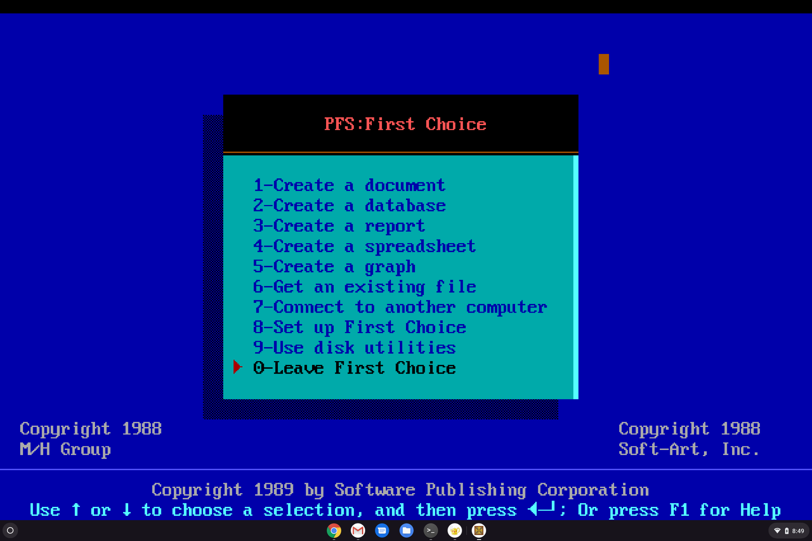

# First Choice Convertor

This is a python program to convert PFS:First Choice database files.

## Author
Paul H Alfille 2020

## History
### Why First Choice
I found First Choice a great solution for indexing collections for myself and my wife, back in the early DOS days. Although Windows and other developements left that program behind, the program still functions, especially in DOSBOX. I run it on Windows, Linux, Mac and even a Chromebook.

The problem with this approach is that in a multi-computer environment (it's 2020!) the program needs to run locally. While the file can be copied over the network prior to program start, and back at the end, it's a fragile process.

### Data Extraction
My first conversion programs were quite successful. See the Sourceforge page: [first2html](http://first2html.sourceforge.net/)

This is a set of perl and C programs that can extract the data to HTML (Which is easy to manipulate for display).

### Current Approach
While extracting data is nice, it would be nice to have a server-based multiuser database with conversion from and to the original First Choice format. The goal is to make the database view and editting web-based.

### Design
* Data extraction with Python3
* Data conversion to SQLite3 for on-line use (via Flask)
* Data converion back to FirstChoice .FOL with python3
* Add journal and backup in SQL.

## Alternatives
* [FirstOut](https://file-convert.com/fout.htm) -- Comercial, extract only
* [First2html](http://first2html.sourceforge.net/) -- Open Source, extract only

## License

FirstChoice  is released under the terms of MIT License.

## Details
Here follows a summary of the discovered fields in a FirstChoice Database.

### Size
All files are in 128 byte blocks. The blocks have relatively set content, and if a record extends beyond 128 bytes, a continuation record follows
### Numbers
Numbers are generally 2-byte little endian unsigned integers. Big Endian is used in some form definition fields!

### Background Text Encoding
Text (for the "background text" in the form) are 3-bytes per character:

| Size |Type| Description |
|-----:|:---|:------------|
|1|byte|Ascii char + highbit|
|||0x80 for space|
|1|byte|0xd0 nornal, 0xd1 _Underline_, 0xd2 **Bold**, 0xd4 *Italic*|
|1|byte|0x81 normal, 0x83 subscript, 0x85 superscript|

### Field Name Encoding
Field names are 2 bytes per char plus a field type char:

| Size |Type| Description |
|-----:|:---|:------------|
|1|byte|Ascii char + highbit|
|||0x80 for space|
||| 0x81 Freeform field type|
||| 0x82 Numeric|
||| 0x83 Date|
||| 0x84 Time|
||| 0x85 Yes/No |
|1|byte|0x90 normal, 0x91 _Underline_, 0x92 **Bold**, 0x94 *Italic*|

0x20 for trailing spaces
0x0d for trailing CR

### Magic fields
* The file extension is ".FOL"
* There is a special string at byte 9 [GERBILDB](http://fileformats.archiveteam.org/wiki/PFS:First_Choice)

### Record types
* Header
* "Half Header" (Optional record 4)
* Empty
* Form description (+ continuations)
* Data record (+ continuations)

### Header
Always first block (block 0)

| Pos | Size |Type| Description |
|----:|-----:|:---|:------------|
|0|2|int|Post-header block|
|2|2|int|Last used block|
|4|2|int|Total file blocks - 1|
|6|2|int|Data records|
|8|14|chars|Magic string '0x0cGERBILDB3   0x00'|
|22|2|int|Number of Database fields (+1)|
|24|2|int|Form length in chars (see below)|
|26|2|int|more1|
|28|2|int|more2|
|30|2|int|more3|
|32|2|int|more4|
|34|2|int|more5|
|36|2|int|more6|
|38|7|chars|Seems fixed as '0xff 0xff 0x00 0x00 0x02 0x00 0x08'|

### Form Description
note that "int-BE" is Big Endian integer

| Pos | Size |Type| Description |
|----:|-----:|:---|:------------|
|0|2|int|0x82 Form description start (only one)|
|2|2|int|total blocks (this + continuations)|
|4|2|int-BE|lines in form screen|
|6|2|int-BE|length+lines+1|
|8|120|data|form fields| 
#### Form Field 
Background text, CR and spaces are optional and may be multiple.

| Size |Type| Description |
|-----:|:---|:------------|
|2|int-BE|Field size (in bytes)|
|3X|text chars| Background text (See Background Text Encoding)|
|1X|char| 0x0d Carriage returns |
|2X|char|Field name (See Field Name Encoding)|
|1X|char| 0x0d Carriage returns |

### Data Record
| Pos | Size |Type| Description |
|----:|-----:|:---|:------------|
|0|2|int|0x81 Data record start|
|2|2|int|total blocks (this + continuations)|

### Data Field
A 0x0d is added to end if next field in on another line

| Size |Type| Description |
|-----:|:---|:------------|
|2|int-BE|Field size (in bytes)|
|1X|chars|Text -- straight ascii|

### Deleted Record / Empty Block
| Pos | Size |Type| Description |
|----:|-----:|:---|:------------|
|0|2|int|0|
|2|126|chars|all 0x00|

### Continuation
| Pos | Size |Type| Description |
|----:|-----:|:---|:------------|
|0|2|int|0x01 Data continuation|
|0|2|int|0x02 Form continuation|
|2|126|data|continuation of prior block payload|

